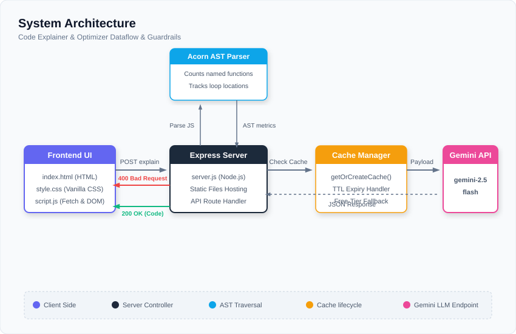

# Code Explainer & Optimizer

A clean, self-contained web tool built using Node.js, Express, and React (Vite) to explain and optimize JavaScript and Python code blocks.

---

## 1. System Architecture & Technical Decisions

The application employs a self-contained, monolithic architecture designed for quick setup and zero-configuration networking.



### Key Technical Decisions:
1. **React State-Driven Frontend**: Migrated the client code to React inside the [frontend/](file:///c:/Users/Lenovo/Downloads/temp/Code-Explainer/frontend) directory. The application UI dynamically updates using React state hooks, improving component reusability and removing fragile DOM manipulation scripts.
2. **Single-Origin Deployment**: The Express server serves the compiled production build from `frontend/dist` using `express.static`. This prevents CORS errors and port-mismatch routing issues.
3. **Abstract Syntax Tree (AST) Pre-Analysis**: For JavaScript code, the backend uses `acorn` and `acorn-walk` to parse and count named functions and loop lines. Pre-supplying structural facts in the prompt limits AI hallucinations regarding code flow logic.
4. **Structured Outputs (JSON Schema)**: The backend configures the Gemini API's `responseSchema` with properties like `inScope`, `outOfScopeMessage`, `explanation`, `timeComplexity`, `spaceComplexity`, and `optimizedCode`. Enforcing a rigid JSON schema guarantees reliable responses without flakey text-splitting code.
5. **Input Scope Guardrails**: Out-of-scope conversational inputs (e.g., general knowledge questions, recipes) are detected using the LLM's classification logic via the `inScope` schema property. Rejections return a `400` status with a polite warning.
6. **Simple, Clean Interface**: Adheres to a light-themed junior-developer-style interface layout (using stacked cards instead of complex tabs) and keeps the React component code compact (~110 lines).

---

## 2. Enlisted Features Added

We have implemented and verified the following key capabilities:

*   **⚛️ React Client Interface**: The client application is implemented as an optimized, single-page React app managed with state variables for inputs, loaders, and structured API payloads.
*   **🔍 Static AST Syntax Analysis (JavaScript only)**: Integrates `acorn` and `acorn-walk` in the backend route to parse JS variables, functions list, and loop lines, making them visible in the "AST Analysis Insights" card on the UI.
*   **🤖 Structured Output Generation**: Configured the Gemini API `responseSchema` to strictly enforce structured JSON returned directly from the model, mapping properties for the explanation, optimized rewrite, time, and space complexities.
*   **🛑 Input Scope Guardrails**: Structured classification checks that intercept out-of-scope non-programming queries (such as cookie recipes or historical queries) on the backend, returning a `400` status with a polite message.
*   **📊 Code Diff Comparison**: Compares the original code and the optimized code using a local line-by-line diffing algorithm, visually highlighting additions (green, with `+` marker) and deletions (red, with `-` marker).
*   **🎨 Clean, Simple UI Aesthetics**: Stacked panels (Original/Optimized code, AST insights, diff comparisons, explanations, warning banners) in a clean, light-theme layout (no bloated tabs), powered by a highly shrunken script.

---

## 3. Installation & Preparation

### Prerequisites
- Node.js (v18+ recommended)
- A Gemini API Key configured in `backend/.env`:
  ```env
  GEMINI_API_KEY=your_actual_gemini_api_key_here
  PORT=3001
  ```

### Installation
1. **Frontend**: Install package dependencies for the React app:
   ```bash
   cd frontend
   npm install
   ```
2. **Backend**: Install package dependencies for the Express server:
   ```bash
   cd ../backend
   npm install
   ```

---

## 4. How to Run the Application


1. **Start the Backend API** (Terminal window 1):
   ```bash
   cd backend
   node server.js
   ```
2. **Start the Frontend Dev Server** (Terminal window 2):
   ```bash
   cd frontend
   npm run dev
   ```
3. Navigate to the Vite development address: **[http://localhost:5173/](http://localhost:5173/)**
   
